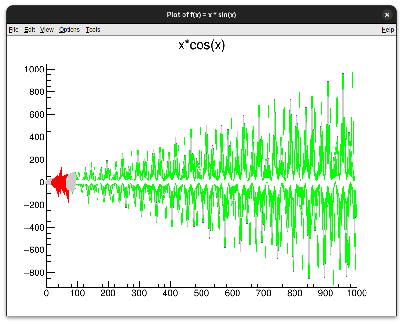

# cern-root-xmas



## How to use

On system with CERN ROOT installed (refer to [https://root.cern/install/](https://root.cern/install/)):

```
g++ main.cxx $(root-config --glibs --cflags --libs) -o cern-root-xmas
./cern-root-xmas
```
